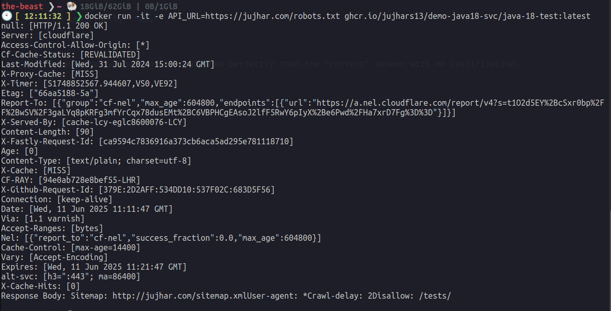

# Test Java Service Project

A simple Java service 18 that retrieves data from our API to test TLS cert issues from certain legacy environments

## Project Structure

```bash
java-demo-svc
├── src
│   └── main
│       ├── java
│       │   └── goodstack
│       │       └── App.java
│       └── resources
├── Dockerfile
├── pom.xml
└── README.md
```

## Configuring

The `API_URL` environment variable can be overridden to a URL of your choice.

eg

```bash
docker run -it -e API_URL=https://jujhar.com/ ghcr.io/jujhars13/demo-java18-svc/demo-java18-svc:latest
```



## Prerequisites

- Docker
- Maven

## Building the Project

To build the project, navigate to the project directory and run:

```bash
mvn clean package
```

This command will compile the Java code and package it into a JAR file.

## Running the Application with Docker

1. Build the Docker image:

   ```bash
   docker build -t java-test .
   ```

2. Run the Docker container, providing the API URL as an environment variable:

   ```bash
   docker run -e API_URL=https://jujhar.com/v1/_health java-test
   ```
